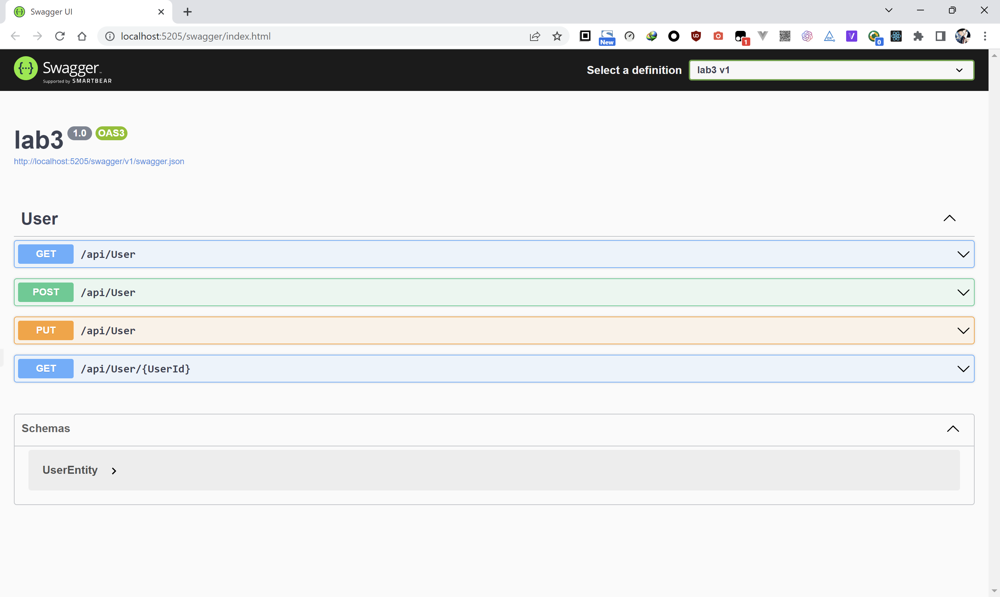
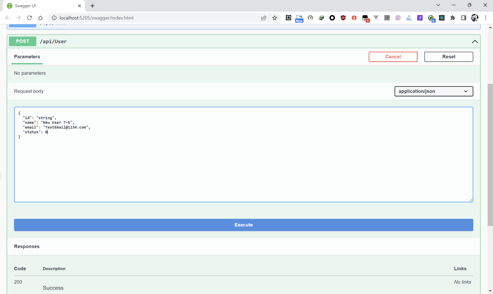
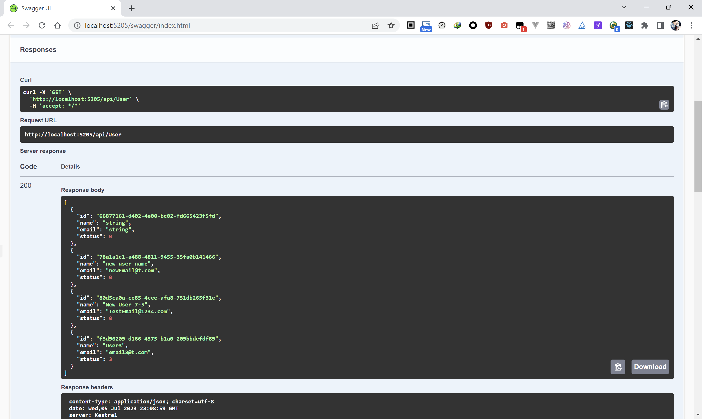
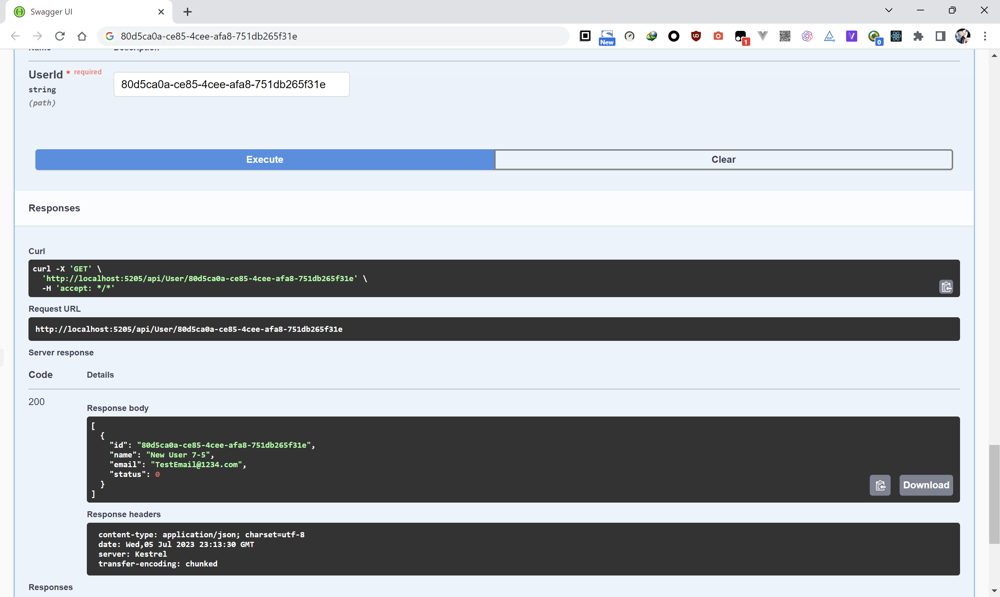
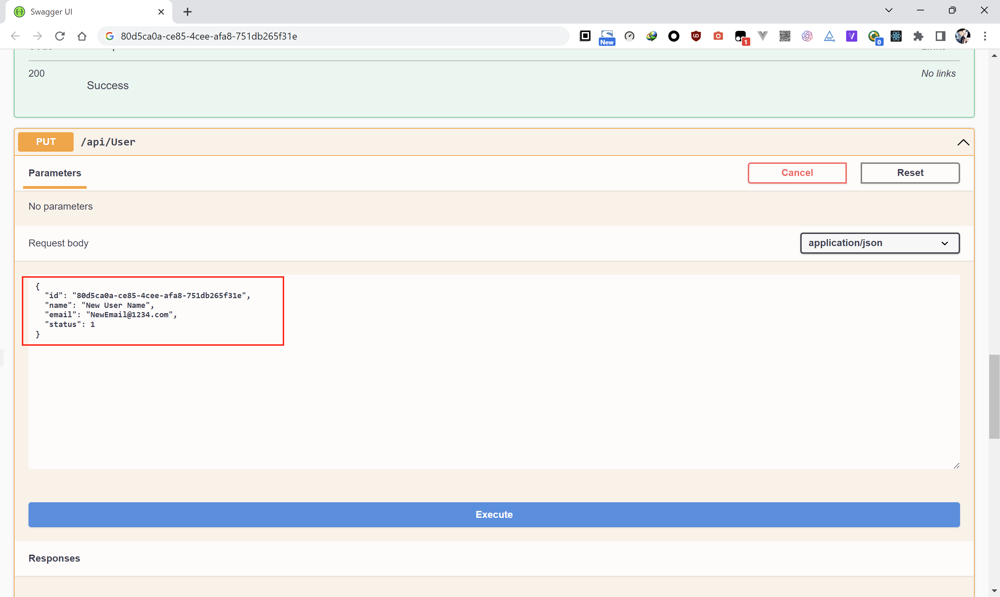
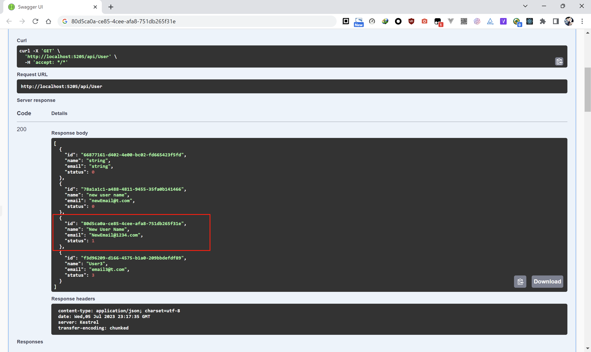

# About the App

This is the project for the Lab3 for Conestoga College PROG8185-23S-Sec1-Web Technologies.


## Run the App

Move to the root folder of the project, use the command below to run the App.

```powershell
dotnet watch run
```


Then the Swagger will be displayed with the APIs 




### Create a new user

Select the Post API in Swagger, click "try out", add a new user's information (The id of user is unecessary, because the new one will be generated automatically).




### Retrieve all users

Select the get API without param, it will response the list of all users in the database.




### Retrieve User by ID

Copy a user id, for instance, <mark>80d5ca0a-ce85-4cee-afa8-751db265f31e</mark> from the screen below.

Select the get API with param (UserId), then paste the id, and the program will only return the User with valid id.




### Update User by Id

Select the put API, fill the JSON data of a user info needs to be updated (id should not be modified forever), then execute and check the result.




